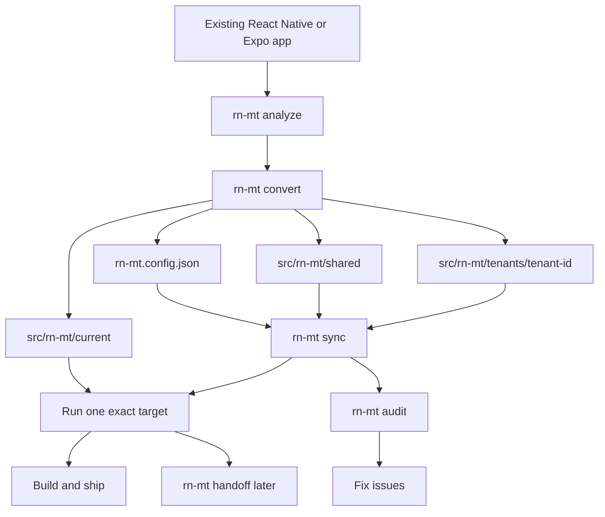
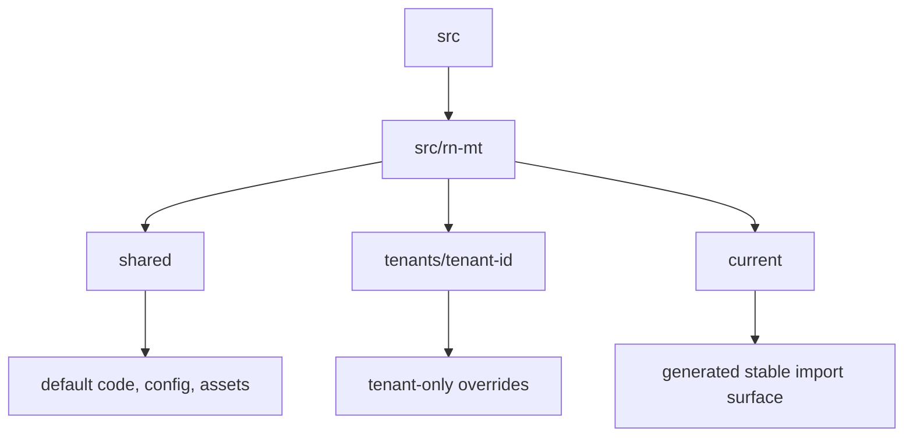
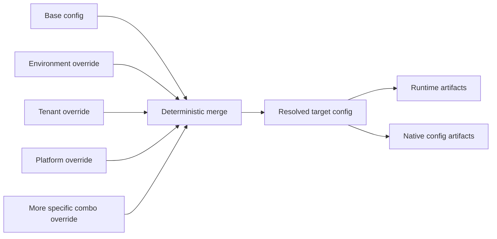
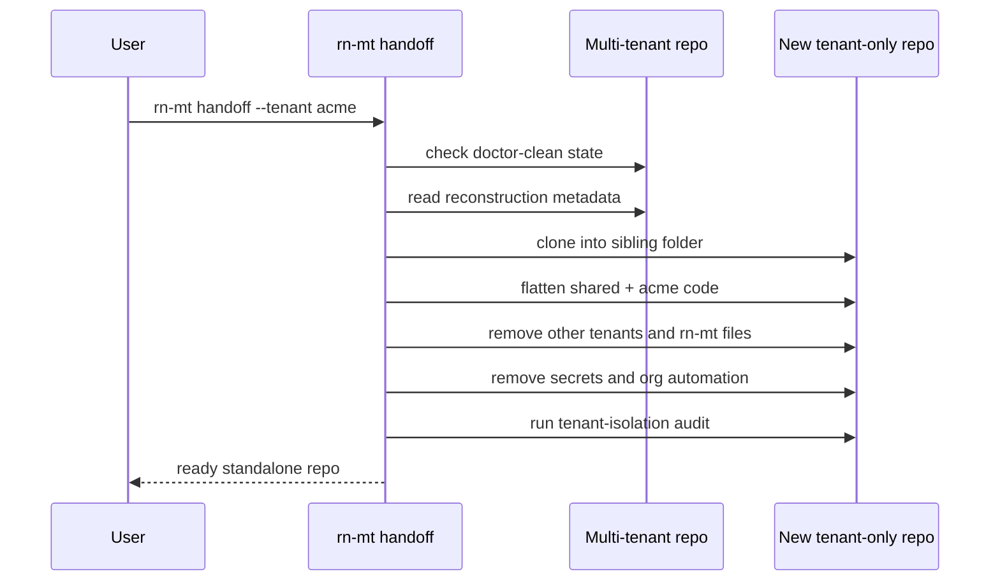

# rn-mt Design Decisions Handbook

This is the easiest doc in the repo for understanding why `rn-mt` exists and why it is shaped the way it is.

Important note:

- The raw 171-question interview transcript is not committed in this repo.
- This handbook rebuilds the full 171 design Q&A from the final approved source docs:
  - `docs/issues/0001-rn-mt-prd.md`
  - `docs/issues/0002-rn-mt-brd.md`
  - `docs/architecture.md`
- So this file is a reconstructed decision record, not a word-for-word transcript.
- If there is ever a conflict, the PRD and BRD win.

## Start Here

`rn-mt` is a tool that helps a team take one existing React Native or Expo app and turn it into one clean repo that can ship many branded versions of that app.

Very simple example:

- one codebase
- many brands
- one main config file
- repeatable native setup
- clear developer workflow
- later, a clean way to export one brand into its own repo

## Main Words

- `tenant`: one brand, client, market app, or white-label version
- `environment`: `dev`, `staging`, `prod`, and similar stages
- `platform`: `ios` or `android`
- `target`: one exact combo like `acme + staging + ios`
- `manifest`: the main JSON config file, `rn-mt.config.json`
- `shared`: code that every tenant uses
- `override`: a tenant-specific replacement for a shared file
- `current`: a generated folder that shows the exact active target view
- `handoff`: exporting one tenant into its own normal single-tenant repo

## One-Picture View



## Package Shape

```mermaid
flowchart LR
    CLI[@rn-mt/cli] --> CORE[@rn-mt/core]
    CLI --> RUNTIME[@rn-mt/runtime]
    CLI --> EXPO[@rn-mt/expo-plugin]
    EXPO --> CORE
    RUNTIME --> CORE
```

What each package does:

- `@rn-mt/cli`: commands, prompts, output, package-manager calls
- `@rn-mt/core`: the hard logic, like schema validation, resolution, analysis, sync, audit, and later handoff reconstruction
- `@rn-mt/runtime`: the tiny safe surface the app reads at runtime
- `@rn-mt/expo-plugin`: the small Expo-specific bridge

## Folder Shape



The converted repo should roughly feel like this:

```text
src/
  rn-mt/
    shared/
      ...normal app code used by everyone
    tenants/
      acme/
        ...files that only acme changes
      globex/
        ...files that only globex changes
    current/
      ...generated view for the selected target
```

## Target Resolution



Simple rule:

- start from the shared base
- apply broader overrides
- apply more specific overrides later
- the most specific valid layer wins last

## Handoff Picture



## Core Rules

- One file owns non-secret product config: `rn-mt.config.json`.
- Secrets do not go into generated runtime config.
- Shared code is the default. Tenant code is the exception.
- Tenant overrides are full-file replacements in v1.
- App code should read from `current`, not from random tenant folders.
- Native integration should use small generated adapters, not giant rewrites.
- Generated files are reviewable and should be committed.
- Audit is a core safety feature, not a nice extra.
- The system should feel normal in daily use: `start`, `android`, `ios` should still make sense.
- Handoff is planned from day one, even if it lands after the first milestone.

## Q&A Map

| Range     | Topic                                       |
| --------- | ------------------------------------------- |
| Q1-Q15    | Foundation and product direction            |
| Q16-Q35   | Manifest and config model                   |
| Q36-Q55   | Analysis and conversion model               |
| Q56-Q75   | Source structure, overrides, and registries |
| Q76-Q95   | Runtime, env, and secrets                   |
| Q96-Q115  | Native and Expo integration                 |
| Q116-Q135 | Scripts, DX, packaging, and upgrades        |
| Q136-Q153 | Audit, testing, CI, and governance          |
| Q154-Q171 | Handoff, later scope, and final rule        |

## 1. Foundation and Product Direction

### Q1. What is `rn-mt`?

Answer:
`rn-mt` is an open-source conversion platform for React Native and Expo apps. It turns one existing app into a manifest-driven multi-tenant workspace.

Why:
Most teams already have a real app. They need help converting it, not just a fresh demo template.

### Q2. Why are we building it?

Answer:
We are building it because the seed idea already worked in one real repo, but that repo used brittle scripts, scattered config, and hardcoded native assumptions. The goal is to turn those lessons into a reusable product.

Why:
The useful idea was real, but the old shape was too project-specific to trust as a general tool.

### Q3. Who is `rn-mt` for?

Answer:
It is for React Native developers, Expo developers, platform engineers, agencies, and multi-brand product teams. It is especially for teams that already feel pain from repo duplication or messy tenant scripts.

Why:
Those teams get the biggest benefit from a shared, repeatable multi-tenant system.

### Q4. What main pain does `rn-mt` fix?

Answer:
It fixes the mess that happens when teams try to support many brands by copying repos, hand-editing native files, and spreading config across too many places. It replaces that with one clear model.

Why:
Without a clear model, every new tenant makes the repo harder to trust.

### Q5. Why not just copy repos per client or brand?

Answer:
Copied repos look easy at first, but they create long-term pain. Every bug fix, UI improvement, and native change has to be repeated over and over.

Why:
Repo-per-tenant scales maintenance cost much faster than product value.

### Q6. Why support existing apps instead of only new templates?

Answer:
Because real teams usually already have a working app before multi-tenant needs appear. They need a path from today’s messy repo to a better future.

Why:
A tool that only helps greenfield apps would miss the real problem.

### Q7. Why support both Expo and bare React Native?

Answer:
Both app styles are common in the real world. A serious multi-tenant tool has to work for teams on either path.

Why:
If the tool only worked for one camp, many real teams would still be stuck.

### Q8. What does “multi-tenant” mean in this project?

Answer:
It means one repo can safely build multiple branded app variants. Each variant can have different config, assets, copy, flags, and some source overrides.

Why:
That is the real white-label and multi-brand problem we are solving.

### Q9. What does `tenant` mean here?

Answer:
`tenant` is the main technical word for one brand, one client, one market-specific app, or one white-label variant. The word stays the same even if business people say “brand” or “client.”

Why:
One stable technical word keeps the product API and docs clear.

### Q10. What does `environment` mean here?

Answer:
`environment` means the stage the app is running in, like `dev`, `staging`, or `prod`. It is not the same thing as a tenant.

Why:
A team may have one tenant running in many environments, so both concepts must stay separate.

### Q11. What does `platform` mean here?

Answer:
`platform` means `ios` or `android`. Some config is shared, but some native identity and asset work must still differ by platform.

Why:
Mobile platforms have real technical differences, so the model has to name them clearly.

### Q12. What does `target` mean here?

Answer:
A `target` is one exact build context, like `acme + staging + ios`. It is the fully resolved thing the CLI should operate on.

Why:
The system must always know exactly which app variant it is generating.

### Q13. What makes `rn-mt` different from project-specific scripts?

Answer:
Project-specific scripts usually hide logic inside one repo and break when the repo changes shape. `rn-mt` is being designed as a stable product with schema, audit, package boundaries, and test strategy.

Why:
We want something teams can understand, trust, reuse, and upgrade.

### Q14. What is the main product promise?

Answer:
The main promise is simple: one repo, many branded apps, clear ownership, predictable config, and safer native setup. Later, it should also let a team export one tenant into a clean standalone repo.

Why:
That covers the whole real lifecycle, from shared development to client delivery.

### Q15. What are the two big milestones?

Answer:
Milestone 1 is the conversion backbone: schema, analysis, conversion, sync, audit, and basic Expo and bare RN integration. Milestone 2 adds handoff polish and more advanced lifecycle features.

Why:
The core must be solid before the export story is finished.

## 2. Manifest and Config Model

### Q16. What file is the source of truth for non-secret config?

Answer:
The source of truth is `rn-mt.config.json`. It owns the main non-secret product configuration.

Why:
One main file is easier to review, validate, and teach.

### Q17. Why is the manifest JSON-only in v1?

Answer:
JSON is strict, predictable, and easy to validate. It also avoids the extra complexity of custom TypeScript execution or flexible YAML parsing.

Why:
We want the first version to be boring in a good way.

### Q18. Why include `schemaVersion` in the manifest?

Answer:
`schemaVersion` gives the product a clean upgrade path. If the manifest shape changes later, the CLI can migrate old files safely.

Why:
Versioned config is safer than guessing what shape a repo is using.

### Q19. Why publish a JSON Schema?

Answer:
The schema gives editors autocomplete, validation, and clearer error messages. It also makes the config contract explicit for contributors and tool builders.

Why:
The manifest should feel like a real product surface, not just a loose JSON blob.

### Q20. Why use keyed objects for tenants and environments instead of arrays?

Answer:
Keyed objects make lookup, add, remove, and rename operations simpler and more deterministic. They also avoid confusion about array order.

Why:
Tenants and environments are named things, not anonymous list items.

### Q21. Why keep one committed default target in the manifest?

Answer:
The repo should have one shared everyday target that everyone can see in git. That way plain `start`, `android`, and `ios` commands stay easy to use.

Why:
The common development target should be explicit and reviewable, not hidden in one person’s local machine.

### Q22. What kinds of things can the manifest describe?

Answer:
It can describe identity, assets, flags, tokens, copy, native settings, support data, and extension data. It is the main home for non-secret tenant and environment differences.

Why:
The point is to gather scattered product config into one predictable place.

### Q23. What is layered override resolution?

Answer:
It means the final config is built by starting from a shared base and then applying more specific layers. For example, a tenant can override some values, and an environment can override others.

Why:
Real white-label apps always have shared defaults plus special cases.

### Q24. In what order do layers apply?

Answer:
The system starts with the base config, then applies broader overrides, and then applies more specific overrides later. The most specific valid match wins last.

Why:
That rule is simple, deterministic, and easier to explain than ad hoc branching.

### Q25. How do object values merge?

Answer:
Objects deep-merge. That means child keys can override only the parts they need without replacing the whole object.

Why:
This keeps shared config reusable while still allowing small changes.

### Q26. How do arrays merge?

Answer:
Arrays replace, not deep-merge item by item. If a layer provides an array, that array becomes the new value.

Why:
Array merging often creates confusing half-results that are hard to predict.

### Q27. How do primitive values merge?

Answer:
Primitives like strings, numbers, and booleans replace the earlier value. The later valid layer wins.

Why:
Replacement is the clearest rule for simple values.

### Q28. Why keep the schema strict?

Answer:
Strict validation catches mistakes early and keeps the product predictable. It stops the manifest from slowly turning into an ungoverned junk drawer.

Why:
Loose config feels flexible at first, then becomes a maintenance trap.

### Q29. Why allow an `extensions` area?

Answer:
Teams still need some app-specific room for data that `rn-mt` does not understand directly. `extensions` gives them that room without weakening the rest of the schema.

Why:
We need a safe escape hatch, not total schema looseness.

### Q30. Why reject YAML and TypeScript manifests for v1?

Answer:
They add too much parsing and execution complexity too early. JSON is enough for the first stable product model.

Why:
First we need reliability, not format variety.

### Q31. Why separate shared identity from native identity?

Answer:
The name humans see and the identifiers native platforms need are related, but not the same thing. One app may share a product name pattern while still needing strict platform-specific IDs.

Why:
Treating them as one field would be too limiting and too risky.

### Q32. Why allow limited design tokens in the manifest?

Answer:
Tenants often need small brand changes like colors, spacing, radius, layout values, and fonts. A limited token surface handles common branding needs without turning `rn-mt` into a full design system tool.

Why:
Branding differences are real, but the product should still stay focused.

### Q33. Why allow limited copy in the manifest?

Answer:
Some tenant differences are simple text changes, like labels, titles, or brand-facing copy. A small copy area lets teams handle those cases cleanly.

Why:
Not every text change should require a full source override.

### Q34. Why skip a dedicated endpoints namespace in v1?

Answer:
API endpoint design varies a lot from app to app. Making it a first-class core feature too early would make the product wider and harder to stabilize.

Why:
The first version should solve the most universal multi-tenant problems first.

### Q35. What should never go inside the manifest?

Answer:
Real secrets should never go into `rn-mt.config.json`. The manifest can describe required secret keys, but not secret values.

Why:
The config file is meant to be committed and reviewed in git.

## 3. Analysis and Conversion Model

### Q36. Why must conversion start with analysis?

Answer:
The CLI should understand the repo before it changes anything. That includes app type, native folder state, package manager, and risk signals.

Why:
A conversion tool should not work by blind guesswork.

### Q37. What does `rn-mt analyze` need to detect?

Answer:
It needs to detect whether the repo is Expo managed, Expo prebuild, or bare RN. It also needs to detect native folders, config style, scripts, and migration risks.

Why:
Those facts decide what kind of conversion path is safe.

### Q38. Why detect Expo managed, Expo prebuild, and bare RN separately?

Answer:
Those repo types share some ideas but have different native workflows. The tool needs to know which world it is in so it can generate the right adapters.

Why:
Wrong classification leads to wrong file changes.

### Q39. Why detect whether `ios` and `android` folders actually exist?

Answer:
A repo may say it is one kind of app but the checkout on disk may tell a different story. The CLI needs the real file state, not assumptions.

Why:
Multi-tenant native setup depends on what is truly present.

### Q40. Why support interactive mode?

Answer:
Some repos will be messy or ambiguous. In those cases, a local developer should be able to confirm what the tool should do.

Why:
The product should be safe in real human workflows, not just perfect repos.

### Q41. Why support non-interactive mode?

Answer:
CI and scripted workflows need deterministic behavior without prompts. The CLI must be able to fail clearly and return structured guidance.

Why:
Automation cannot click through questions.

### Q42. What happens when repo state is ambiguous?

Answer:
In local interactive mode, the CLI can ask the user to confirm the right interpretation. In non-interactive mode, it should stop and report the ambiguity clearly.

Why:
It is better to fail safely than to guess wrong and rewrite the repo badly.

### Q43. Why have both safe and full conversion modes?

Answer:
Different teams want different levels of change. Some want a more conservative first pass, and some want the full structural model right away.

Why:
The product should meet teams where they are without losing its long-term architecture.

### Q44. Which conversion mode is the recommended default?

Answer:
Safe mode is the recommended default for users. It lowers fear and makes first adoption easier.

Why:
People try risky tools less often when the first step feels too aggressive.

### Q45. Why still choose full structural migration as the product direction?

Answer:
Because the real approved architecture is not “a few extra scripts on top.” The real architecture is shared code, tenant overrides, generated current view, and explicit sync.

Why:
Half-converted repos usually keep old problems alive.

### Q46. What does structural migration mean here?

Answer:
It means the repo is reorganized into the new rn-mt model instead of only receiving a small helper layer. The result should feel like a real multi-tenant workspace.

Why:
The product is meant to change the operating model, not just patch around it.

### Q47. Why move general app code into `shared` by default?

Answer:
Most app behavior is common across tenants, so shared code should be the normal home. Tenant-specific code should only exist where it is truly needed.

Why:
This keeps duplication low and makes new tenants cheaper to add.

### Q48. Why preserve the existing `src` subtree shape inside the new model?

Answer:
Teams should still recognize their app after conversion. The new folders change ownership, not the whole mental map of every feature folder.

Why:
A familiar shape makes the migration much easier to understand.

### Q49. Why leave root entry files like `App.tsx` and `index.js` in place?

Answer:
React Native and Expo expect certain top-level entry points. Keeping those files as thin wrappers keeps the toolchain stable.

Why:
We want minimal disruption at the integration edge.

### Q50. Why move config, theme, asset, and test modules too?

Answer:
If those files stay outside the new structure, the repo becomes half old and half new. Full migration should make the new architecture internally consistent.

Why:
A clean system is easier to reason about than a split system.

### Q51. Why rewrite imports to canonical rn-mt paths?

Answer:
The converted repo should directly use the new model, not depend forever on legacy shim paths. That keeps the architecture honest.

Why:
Long-term compatibility shims often become permanent confusion.

### Q52. Why preserve existing aliases when a repo already uses them?

Answer:
Because alias style is part of how that codebase already reads and works. The tool should respect existing conventions when it can.

Why:
Adoption is easier when the converted repo still feels native to the team.

### Q53. Why avoid adding new alias systems to repos that do not already have them?

Answer:
Because alias setup creates extra config churn and more moving parts. If a repo works fine without aliases, the tool should not invent that complexity.

Why:
Minimal correct change is better than unnecessary cleverness.

### Q54. Why keep the support policy explicit?

Answer:
The CLI should clearly say what is supported, near-supported, and unsupported. It should not pretend to work on every strange host stack.

Why:
Clear limits build more trust than vague promises.

### Q55. Why focus v1 on modern React Native and Expo versions?

Answer:
Older project shapes add a huge support surface. The first version needs to be robust on modern stacks before it expands.

Why:
Trying to support too many old shapes too early would slow the whole product down.

## 4. Source Structure, Overrides, and Registries

### Q56. What folders will the converted app use?

Answer:
The main folders are `src/rn-mt/shared`, `src/rn-mt/tenants/<tenant>`, and `src/rn-mt/current`. Together they define default code, tenant-only code, and the generated active view.

Why:
Those three surfaces keep ownership simple.

### Q57. What goes inside `shared`?

Answer:
`shared` holds code, config, assets, themes, and tests that all tenants can use by default. It is the main home of the app.

Why:
Common behavior should live in one obvious place.

### Q58. What goes inside `tenants/<tenant>`?

Answer:
That folder holds files that only one tenant changes. It mirrors the shared path shape so overrides stay easy to understand.

Why:
Tenant-specific code needs clear boundaries and ownership.

### Q59. What goes inside `current`?

Answer:
`current` is a generated facade for the selected target. It exposes the final tenant-first, shared-fallback view the app should import from.

Why:
App code needs one stable place to read from.

### Q60. Why generate a `current` facade at all?

Answer:
Without it, app code would need to know too much about tenant folder resolution. `current` hides that complexity behind one stable surface.

Why:
The host app should not be littered with tenant path logic.

### Q61. How does source resolution work?

Answer:
The system looks for a tenant-specific file first. If that file does not exist, it falls back to the shared file.

Why:
This rule is simple enough for a new engineer to remember immediately.

### Q62. Why choose full-file overrides in v1?

Answer:
Full-file replacement is easy to reason about and easy to audit. Partial patches inside source files would be much harder to track safely.

Why:
Simple override behavior beats clever but fragile behavior.

### Q63. Why have `rn-mt override create`?

Answer:
Creating a tenant override should be intentional, not a random copy-paste action. A command makes that step visible and repeatable.

Why:
The product should guide teams into a clean workflow.

### Q64. Why have `rn-mt override remove`?

Answer:
When a tenant no longer needs a custom file, the team should be able to fall back to shared behavior cleanly. Removing the override should be as first-class as creating it.

Why:
Overrides should be easy to prune, not easy to accumulate forever.

### Q65. Why mirror shared paths inside tenant folders?

Answer:
The mirrored structure makes it obvious which shared file a tenant file is replacing. A new engineer can compare paths and understand the relationship fast.

Why:
The path itself becomes documentation.

### Q66. Why keep tenant-specific assets, fonts, components, and features first-class?

Answer:
Real tenants often change more than colors. They may have different images, fonts, screens, or feature slices.

Why:
The architecture has to match real brand variation, not just shallow theming.

### Q67. Why should app code import from `current` instead of raw tenant paths?

Answer:
Because raw tenant paths leak internal structure into the app. `current` keeps the public surface stable even if internal generation changes later.

Why:
Stable surfaces make long-term maintenance easier.

### Q68. Why add static registries for routes, features, menus, and actions?

Answer:
Some tenant differences are about composition, not just file replacement. Static registries let the product control which pieces are present in a more structured way.

Why:
Feature composition should not depend on scattered `if tenant === ...` checks everywhere.

### Q69. Why use stable item IDs in registries?

Answer:
Stable IDs let the system add, replace, or disable specific items safely. The ID becomes the durable handle for change.

Why:
You cannot manage registries well if items have no stable identity.

### Q70. What operations can a registry support?

Answer:
The design supports `add`, `replace`, and `disable` by stable ID. That gives teams useful control without forcing full registry forks.

Why:
These operations cover the most common tenant variation patterns.

### Q71. Why make flag-gating static instead of scattered runtime checks?

Answer:
Static resolution gives one clear final surface for the target. It reduces the amount of tenant logic hidden inside running app code.

Why:
Less runtime branching usually means simpler behavior and easier debugging.

### Q72. Why support `add`, `replace`, and `disable` instead of full registry copies?

Answer:
Because full copies create duplication fast. Small targeted changes keep tenant composition readable and cheaper to maintain.

Why:
The product should push teams toward minimal differences.

### Q73. Why keep the runtime API small?

Answer:
The runtime package should expose only what host apps really need: config, tenant, env, flags, and assets. It should not expose deep internal machinery.

Why:
Small public surfaces are easier to keep stable.

### Q74. Why avoid a general plugin system in v1?

Answer:
A plugin system would widen the product a lot and make behavior harder to reason about. The first version should focus on explicit structure, not dynamic extension everywhere.

Why:
We need a solid core before opening many extension paths.

### Q75. Why support bridge mode but keep it narrow?

Answer:
Some mature apps need a gentle connection into existing config modules. Bridge mode helps there, but it should not become an excuse to avoid the real architecture.

Why:
Bridge mode is a migration aid, not the main product shape.

## 5. Runtime, Env, and Secrets

### Q76. What does the runtime package expose?

Answer:
It exposes a small stable way to read resolved config, tenant, environment, flags, and assets inside the app. It is the safe runtime entry point.

Why:
Apps need a simple API, not direct access to internal generation logic.

### Q77. Why not let app code touch generated internal files directly?

Answer:
Internal generated files may evolve as the product grows. A stable runtime surface protects host apps from those internal changes.

Why:
Good product boundaries reduce future breaking changes.

### Q78. Where do secrets live?

Answer:
Secrets live outside the committed runtime config. They come from env inputs that the CLI loads and validates.

Why:
Secret values should not be sitting in generated files committed to git.

### Q79. What is `envSchema`?

Answer:
`envSchema` is the contract that says which secret keys are required and at what scope. It describes the shape of secret input without storing the secret values themselves.

Why:
The system needs strict validation without leaking sensitive data.

### Q80. Why does the CLI own env loading?

Answer:
Because env loading is part of target resolution, validation, and command execution. Keeping it inside the CLI makes behavior consistent across Expo and bare RN.

Why:
One owner for env rules is clearer than many ad hoc loaders.

### Q81. Why not require `react-native-config`?

Answer:
Making it mandatory would tie the product to one brittle strategy. `rn-mt` should work without forcing that dependency on every host app.

Why:
The product should own its own env story by default.

### Q82. When can `react-native-config` still be used?

Answer:
It can still be used as an optional bridge or migration helper when a host app already depends on it. It is allowed, but not foundational.

Why:
That keeps migration practical without making the product depend on it.

### Q83. What env file naming pattern was chosen?

Answer:
The chosen pattern is `.env.<environment>` and `.env.<tenant>.<environment>`. This keeps tenant and environment context clear in the filename itself.

Why:
Clear names reduce mistakes when many env files exist.

### Q84. Why keep generated runtime config free of secret values?

Answer:
Generated runtime files are meant to be reviewable and committed. Secret-free artifacts are much safer to keep in the repo.

Why:
The product must separate reviewable config from sensitive input.

### Q85. What config can runtime safely expose?

Answer:
It can safely expose resolved non-secret things like identity, flags, copy, token values, and asset references. Those are part of the app’s normal behavior.

Why:
The runtime surface should expose only what the app actually needs on device.

### Q86. Why support flags in runtime?

Answer:
Flags let teams turn features on or off per tenant and target. They are a common and useful kind of product difference.

Why:
Feature gating is a normal part of multi-tenant apps.

### Q87. Why support assets in runtime?

Answer:
Tenants often need different icons, images, or brand resources. The runtime should have a clean way to resolve those references.

Why:
Brand assets are one of the most common multi-tenant differences.

### Q88. Why support tokens in runtime?

Answer:
Apps need resolved brand tokens at runtime for visuals like color, spacing, or font choices. The app should not have to rebuild that logic itself.

Why:
Resolved tokens are part of the final target view.

### Q89. Why support copy in runtime?

Answer:
Brand-facing labels and small text changes are often target-specific. A small runtime copy surface handles those cases cleanly.

Why:
Not every tenant text change should require a whole source fork.

### Q90. Why keep the copy surface limited?

Answer:
Because `rn-mt` is not trying to become a full CMS. It should handle common brand text differences, not every content management problem.

Why:
Product focus matters.

### Q91. Why keep the token surface limited?

Answer:
Because `rn-mt` is not trying to replace a full design system or theme engine. It only needs enough token coverage to support common tenant branding.

Why:
The goal is useful scope, not endless scope.

### Q92. Why keep env resolution deterministic?

Answer:
The same target and the same repo state should resolve to the same result every time. That is required for trust, debugging, and CI.

Why:
If env behavior changes unpredictably, the whole product becomes hard to believe.

### Q93. Why make tenant and environment explicit in run and build flows?

Answer:
Because teams need to know exactly what they are running. The wrong tenant or wrong environment can create real release mistakes.

Why:
Explicit target context is safer than implicit magic.

### Q94. Why keep one stable runtime access surface across host apps?

Answer:
Host apps should learn one small API and keep using it. That is easier than teaching every app a different internal file layout.

Why:
Consistency reduces onboarding cost.

### Q95. Why avoid runtime tenant switching inside one installed app binary?

Answer:
Because native identity, assets, app store packaging, and many build-time details differ per tenant. Runtime switching would be a different product with different constraints.

Why:
The first version is about deterministic build targets, not one binary pretending to be many apps.

## 6. Native and Expo Integration

### Q96. Why separate shared identity from native identity in practice?

Answer:
The product name a person sees is not enough for native packaging. Android and iOS also need strict identifiers and native-facing settings.

Why:
Mobile stores and native build tools care about exact platform identity.

### Q97. How will Android model tenant and environment?

Answer:
Android will use separate flavor dimensions for `tenant` and `environment`. That makes the two concerns explicit and composable.

Why:
Tenant and environment are different axes, so the build model should show that.

### Q98. Why keep Android build types as `debug` and `release`?

Answer:
Because build type already has a clear native meaning. We do not need to overload it with tenant or environment logic.

Why:
Keeping native concepts clean reduces confusion.

### Q99. Why use flavor dimensions on Android?

Answer:
Flavor dimensions are the natural Android way to express combinable variant axes. They map well to tenant and environment.

Why:
We should use the platform’s own model where it fits.

### Q100. How will iOS model tenant and environment?

Answer:
iOS will use one shared target plus generated tenant-environment schemes and xcconfig includes. It avoids a giant explosion of native targets.

Why:
Many separate iOS targets become painful to maintain quickly.

### Q101. Why use one shared iOS target instead of many targets?

Answer:
Many targets create a lot of Xcode overhead, drift, and repeated native settings. One shared target with generated schemes is leaner.

Why:
The product wants native variation without native sprawl.

### Q102. What are generated tenant-environment schemes?

Answer:
They are the named iOS entry points for exact target contexts like `acme-staging`. They tell Xcode which generated config to use.

Why:
Schemes are a clean iOS way to represent runnable variants.

### Q103. What are xcconfig includes doing in this design?

Answer:
They hold generated native configuration that can be included cleanly into the iOS build system. They let the CLI update config without rewriting everything.

Why:
Small generated include files are safer than giant raw file rewrites.

### Q104. Why use small anchored native patches instead of giant rewrites?

Answer:
Small patches are easier to keep stable as host apps evolve. Giant rewrites are brittle and hard to review.

Why:
The less invasive the native mutation, the safer long-term sync becomes.

### Q105. How will Expo integration work?

Answer:
Expo integration will use `app.config.ts` as the computed layer and a narrow Expo plugin to derive native-facing values. It should still work sensibly with Expo’s normal config flow.

Why:
Expo needs a first-class path that fits how Expo apps already work.

### Q106. Why use `app.config.ts` as the authoritative computed layer?

Answer:
Because `app.config.ts` is the place where Expo can compute config dynamically. That makes it the right place to apply resolved target context.

Why:
Expo apps already treat it as the smart config layer.

### Q107. Can Expo still layer on top of `app.json`?

Answer:
Yes. The design keeps compatibility with the normal Expo pattern where `app.config.ts` can build on top of `app.json`.

Why:
That reduces migration shock for existing Expo teams.

### Q108. Why keep the Expo plugin narrow?

Answer:
The plugin should do one job well: translate resolved target context into Expo-compatible native config. It should not become a second core engine.

Why:
Clear boundaries keep the system easier to test and upgrade.

### Q109. Why should the Expo plugin read explicit target context?

Answer:
Because guessing tenant and environment inside Expo config is fragile. The plugin should receive clear, already-resolved context from the CLI.

Why:
Explicit input is much safer than hidden inference.

### Q110. Why auto-derive non-production bundle IDs when possible?

Answer:
Non-production builds often need to live beside production on the same device. Derived IDs make that easier without manual work every time.

Why:
Development and staging installs should coexist cleanly.

### Q111. Why add non-production display name suffixes by default?

Answer:
So a developer can see at a glance that an installed app is not production. It helps in launchers, switchers, and test devices.

Why:
The wrong app icon or label causes very real confusion.

### Q112. Why badge non-production icons by default?

Answer:
Badged icons give a fast visual warning that the app is development or staging. That helps prevent testing and demo mistakes.

Why:
Visual safety is useful in mobile workflows.

### Q113. Why keep source assets in place?

Answer:
Teams already have their own asset organization. `rn-mt` should not force a big relocation unless there is a real reason.

Why:
The product should own generated outputs, not every source folder choice.

### Q114. Why only own derived platform assets?

Answer:
Derived assets are generated machine outputs, so it makes sense for the CLI to own them. Source assets are still user-owned inputs.

Why:
Clear ownership prevents file-editing confusion.

### Q115. Why do asset generation in Node instead of system tools?

Answer:
Node-based generation is more portable across macOS, Linux, Windows, and CI. System tools like `sips` or ImageMagick make cross-platform use harder.

Why:
The CLI should work in more places with fewer hidden prerequisites.

## 7. Scripts, DX, Packaging, and Upgrades

### Q116. What should daily commands feel like after conversion?

Answer:
They should still feel normal. A team should still recognize common commands and not feel trapped inside a strange new workflow.

Why:
Good tooling should reduce daily friction, not add it.

### Q117. Why keep top-level `start`, `android`, and `ios` scripts familiar?

Answer:
Those commands are muscle memory for mobile teams. The product should preserve that familiarity while making the target context explicit behind the scenes.

Why:
Adoption is easier when the most common commands still make sense.

### Q118. What are `rn-mt:*` helper scripts?

Answer:
They are the namespaced helper scripts for more explicit target or maintenance tasks. They keep the top-level script surface clean while still exposing richer behavior.

Why:
Not every helper command should crowd the main package script list.

### Q119. Why wire `prestart`, `preandroid`, `preios`, and `postinstall` hooks?

Answer:
These hooks let the product sync generated state automatically during normal work. They help keep the repo accurate without requiring developers to remember extra manual steps.

Why:
A good workflow is one that people actually follow.

### Q120. Why keep hooks incremental?

Answer:
Because full regeneration on every command would get slow fast. Incremental work keeps the workflow practical.

Why:
Teams will stop trusting a tool that makes everyday commands painfully slow.

### Q121. What info should the CLI banner show?

Answer:
It should show the active tenant, environment, platform, identity, config source, and sync status. The banner is the quick truth screen before the app runs.

Why:
People need immediate visibility into what they are about to launch.

### Q122. Why install local pinned `@rn-mt/*` packages in converted repos?

Answer:
So the repo’s behavior is reproducible for every team member and CI. The project should not depend on whichever global CLI version someone happens to have.

Why:
Local pinned dependencies are safer than global drift.

### Q123. Why still allow a global `rn-mt` command?

Answer:
The global command is useful as a bootstrap and entry point. It helps teams discover and start using the tool quickly.

Why:
Bootstrap convenience and repo-local reproducibility can both exist together.

### Q124. Why check global and local version compatibility?

Answer:
Because a global entry point may call into a repo that expects a different local package set. The tool should detect mismatch instead of behaving strangely.

Why:
Version drift should fail loudly, not silently.

### Q125. What should `rn-mt upgrade` do?

Answer:
It should upgrade packages, migrate metadata if needed, then run sync and audit. In short, it should reconcile the repo into a healthy current state.

Why:
Upgrade should be a guided workflow, not a bag of manual steps.

### Q126. Why auto-detect the package manager?

Answer:
Because the host repo already has a package-manager reality, and the converted repo should keep working right away. The tool should adapt to the repo instead of forcing a random change.

Why:
Respecting the host repo lowers friction.

### Q127. Why keep added dependencies minimal?

Answer:
Every extra dependency adds maintenance cost and risk. The product should add only what it truly needs.

Why:
Lightweight integration makes adoption easier and safer.

### Q128. Why make single-app repos the first target?

Answer:
Because that is the most common adoption path and the smallest stable surface for milestone 1. It keeps the first release focused.

Why:
A clear first target increases the chance of shipping a strong v1.

### Q129. How will monorepo support work later?

Answer:
Later, teams should be able to point `rn-mt` at a specific app root inside a larger workspace. The design already leaves room for that by scoping one manifest per app root.

Why:
We want future flexibility without overloading the first milestone.

### Q130. Why allow one manifest per app root?

Answer:
One app root should have one clear source of truth. That keeps scope and ownership clean, even in larger workspaces.

Why:
Many manifests for one app would create confusion fast.

### Q131. Why keep `tenant` as the canonical product word?

Answer:
Because the technical model needs one precise term, even if business teams say “brand” or “client.” Docs can explain the word, but the API should stay stable.

Why:
Stable vocabulary makes the product easier to learn and maintain.

### Q132. Why commit generated runtime and native include files?

Answer:
Committed generated artifacts make builds reproducible and reviewable. Teams can see exactly what changed.

Why:
Generated does not have to mean hidden.

### Q133. Why treat generated files as CLI-owned?

Answer:
Because the CLI needs to be able to overwrite them safely during sync. If people hand-edit them freely, the system becomes unreliable.

Why:
Ownership rules prevent accidental fights between humans and the generator.

### Q134. Why provide user-owned extension files too?

Answer:
Teams still need safe places to add custom helper logic. User-owned extension files provide that without editing generated outputs.

Why:
A good tool needs both machine-owned and human-owned spaces.

### Q135. Why avoid telemetry and surprise network calls?

Answer:
Developers and enterprises trust local-first tools more. Normal operations should work from local repo state, not from hidden remote behavior.

Why:
Predictability and privacy matter for adoption.

## 8. Audit, Testing, CI, and Governance

### Q136. Why is audit a first-class feature?

Answer:
Because multi-tenant repos can fail in quiet, dangerous ways: wrong tenant references, stale generated files, config drift, or leaked brand assets. Audit is how the tool helps teams catch that before shipping.

Why:
Safety is not optional in this kind of product.

### Q137. What kinds of checks will audit run?

Answer:
It will run deterministic checks and heuristic checks. Deterministic checks look for exact known rules, while heuristics look for suspicious patterns.

Why:
Both strict errors and soft warning signals matter in real repos.

### Q138. What is the difference between deterministic and heuristic findings?

Answer:
Deterministic findings are clear rule breaks, like a missing generated file or invalid config shape. Heuristic findings are smart guesses, like code that looks tenant-specific but still lives in shared.

Why:
Some problems are exact; some are fuzzy but still important.

### Q139. Why give each finding a severity level?

Answer:
Severity tells teams how serious the issue is, like `P0` through `P3`. It helps them decide what must block work and what can wait.

Why:
Not all findings deserve the same response.

### Q140. Why give each finding fixability metadata?

Answer:
Fixability tells the team whether the issue can be auto-fixed, likely fixed, or needs manual judgment. That makes the report more actionable.

Why:
A finding is more useful when it also hints at the effort level.

### Q141. Why give heuristic findings confidence and evidence?

Answer:
Because heuristics are not absolute truth. Confidence and evidence help a human judge whether the tool’s suspicion is strong or weak.

Why:
The report should be honest about what it knows and what it is inferring.

### Q142. Why support ignore rules?

Answer:
Teams will always have a few intentional exceptions. Ignore rules let them document those cases instead of fighting the tool forever.

Why:
Governance should be strict but still practical.

### Q143. Why support fail thresholds like `--fail-on P1`?

Answer:
Different teams have different quality bars. Thresholds let CI block only the levels a team cares about.

Why:
Flexible enforcement makes adoption easier without weakening the model.

### Q144. Why make `--json` output first-class?

Answer:
Because CI systems, scripts, and future editor tools need machine-readable output. Humans are not the only consumers of the CLI.

Why:
Structured output is a real product feature, not just a convenience.

### Q145. Which commands should support JSON output?

Answer:
Key commands like `analyze`, `convert`, `sync`, `audit`, `doctor`, and `upgrade` should support it. These are the commands most likely to feed automation.

Why:
The important operational commands should be script-friendly.

### Q146. Why use fixture-based integration tests?

Answer:
Because `rn-mt` changes real repo structure, not just tiny functions. The best test is to run the tool against realistic sample apps and inspect the result.

Why:
Repo transformation tools need repo-shaped tests.

### Q147. What fixture apps do we need?

Answer:
We need at least a bare RN app, an Expo managed app, an Expo prebuild app, and a deliberately messy app. That set covers the main supported shapes plus a realistic stress case.

Why:
One clean happy-path fixture would not be enough.

### Q148. Why also test deep core modules in isolation?

Answer:
Core modules like schema validation, resolution, analysis, patch planning, and audit scoring carry the hardest logic. They deserve direct contract tests too.

Why:
Good product confidence comes from both unit-level and repo-level testing.

### Q149. What should CLI tests focus on?

Answer:
They should focus on external behavior: commands, output, exit status, generated files, and user-visible flows. They should not be tightly coupled to internals.

Why:
A CLI is a user surface, so user-visible behavior matters most.

### Q150. What should runtime tests focus on?

Answer:
They should focus on the stable access surface exposed to host apps. The important question is whether app code gets the right data cleanly.

Why:
The runtime package is a contract, not an implementation showcase.

### Q151. What should Expo plugin tests focus on?

Answer:
They should verify that explicit target context becomes the correct Expo-compatible config. They should also prove the plugin stays deterministic with `app.config.ts` behavior.

Why:
The plugin’s job is narrow, so its tests should be narrow and sharp too.

### Q152. Why not use the inspiration repo as the main test bed?

Answer:
Because that repo is the problem source, not a clean rn-mt product fixture. The new product needs its own controlled test matrix.

Why:
Product tests should be designed for the product, not borrowed accidentally.

### Q153. Why keep package boundaries aligned with product boundaries?

Answer:
Because package boundaries become thinking boundaries. When CLI, core, runtime, and Expo roles are clear, the codebase and docs stay easier to understand.

Why:
Good architecture is also good communication.

## 9. Handoff, Later Scope, and Final Rule

### Q154. What is `rn-mt handoff`?

Answer:
`handoff` is the future command that exports one tenant into a clean standalone repo. The output should look like a normal single-tenant app, not like a sliced piece of a multi-tenant workspace.

Why:
Client delivery is a real business need, so the product has to plan for it.

### Q155. Why is handoff a later milestone instead of part of the first release?

Answer:
Because handoff depends on a strong conversion backbone and reconstruction metadata. The core conversion and sync model must exist first.

Why:
Export quality depends on conversion quality.

### Q156. Why must conversion store reconstruction metadata now?

Answer:
Because later handoff needs to know how to rebuild a normal tenant-only repo correctly. That knowledge has to be captured during conversion, not guessed years later.

Why:
Future export fidelity depends on present-day metadata.

### Q157. Why create handoff output in a new sibling folder?

Answer:
Because handoff should never mutate the source repo in place. A separate output location is much safer.

Why:
Client export should not put the working multi-tenant repo at risk.

### Q158. Why refuse overwrites unless the user forces them?

Answer:
Because export output may contain valuable work or inspection state. Overwriting it silently would be dangerous.

Why:
Safe file behavior matters a lot for generated repos.

### Q159. Why strip git history by default?

Answer:
Because client delivery should not accidentally expose the full internal development history. The clean output should start fresh.

Why:
History can leak unrelated tenants and internal context.

### Q160. Why create a fresh git repo in the output?

Answer:
The receiving team should get a normal standalone repo that feels like their own starting point. A fresh repo also makes the handoff cleaner to transfer.

Why:
The output should feel like a real delivered product, not a temporary extraction folder.

### Q161. Why flatten shared plus tenant code back into a normal app structure?

Answer:
Because the client only needs their app, not the internal multi-tenant architecture. The handoff output should be simple for them to understand.

Why:
Handoff is about delivery clarity, not preserving internal framework shape.

### Q162. Why remove `rn-mt` and multi-tenant machinery from handoff output?

Answer:
The client repo should not carry tools and files that only mattered for multi-tenant maintenance. It should look like a normal single-tenant app.

Why:
The delivered repo should fit the receiver’s actual needs.

### Q163. Why remove org-specific CI/CD and automation?

Answer:
Internal pipelines, release glue, and company automation may expose secrets, assumptions, or irrelevant complexity. Those should not leave the source organization by default.

Why:
Clean separation is part of safe client delivery.

### Q164. Why remove real env files and keep only sanitized examples?

Answer:
Because real env files may contain secrets or sensitive internal values. Example templates are enough to show the receiving team what they need to fill in.

Why:
The product must treat secret hygiene as a default, not a hope.

### Q165. Why run a final tenant-isolation audit before success?

Answer:
Because the whole point of handoff is giving one tenant and only that tenant. The final audit is the last safety check against cross-tenant leakage.

Why:
Trust in handoff depends on proof, not just intention.

### Q166. Why keep failed handoff output folders for inspection?

Answer:
Because partial output can help a team understand what went wrong. Deleting it automatically would remove useful debugging evidence.

Why:
Failure should still leave something inspectable.

### Q167. Why require doctor-clean state before handoff?

Answer:
If the source repo is already unhealthy, the output cannot be trusted. Handoff should start from a clean, validated state.

Why:
Garbage in, garbage out.

### Q168. Why support optional zip packaging?

Answer:
Because some delivery workflows want one packaged artifact that is easy to transfer. Zip output is a practical convenience on top of the repo export.

Why:
The final mile of delivery should be easy too.

### Q169. What is out of scope for v1?

Answer:
Out of scope includes runtime tenant switching in one binary, first-class web conversion, signing credential management, broad business-logic rewrites, partial source overlays, and non-JSON manifests. These are all intentionally left out.

Why:
A focused v1 is more likely to be strong than a giant v1 that tries to solve everything.

### Q170. What remains for milestone 2 besides handoff?

Answer:
Milestone 2 also includes advanced codemods, override polish, rollback polish, upgrade polish, and richer registry ergonomics. These build on the backbone created in milestone 1.

Why:
The second milestone is for higher-level convenience after the core is proven.

### Q171. What is the final simple rule behind all these decisions?

Answer:
Keep the system explicit, deterministic, and easy to reason about. If a new feature makes the product feel magical but harder to trust, it is probably the wrong choice.

Why:
That rule is the thread connecting the whole design.

## Source Docs

If you want the deeper source material behind this handbook, read these next:

- `docs/issues/0001-rn-mt-prd.md`
- `docs/issues/0002-rn-mt-brd.md`
- `docs/architecture.md`

## Final Summary

If you only remember seven things, remember these:

- `rn-mt` converts existing apps, not just new templates.
- `rn-mt.config.json` is the main non-secret source of truth.
- Shared code is the default. Tenant code is the exception.
- `current` is the stable public import surface for the app.
- Secrets stay out of generated runtime config.
- Generated files are committed and CLI-owned.
- Handoff is planned from the start, even though it lands after the backbone work.
