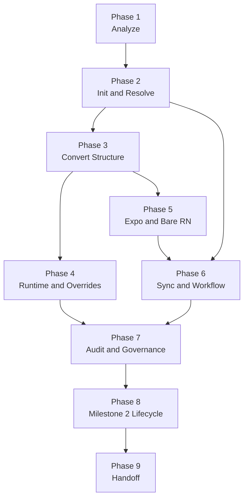

# rn-mt Roadmap

This document maps the PRD and child GitHub issues into a practical execution order.

Use this when you want to answer simple planning questions like:

- What should we build first?
- Which issues belong to milestone 1?
- Which work can happen in parallel?
- What is blocked right now?
- Which issues are handoff-only milestone 2 work?

## Source of Truth

The planning stack for this repo is:

- Parent PRD issue: `#1`
- Tracer-bullet child issues: `#2` to `#61`
- Product PRD doc: `docs/issues/0001-rn-mt-prd.md`
- BRD doc: `docs/issues/0002-rn-mt-brd.md`
- Architecture map: `docs/architecture.md`
- Design decisions handbook: `docs/design-decisions-handbook.md`

If this roadmap ever disagrees with the GitHub issues, the GitHub issues win.

## How To Read This

- A **phase** is a planning bucket.
- A **workstream** is a set of related issues that can often move together.
- An issue marked **AFK** can usually be built without a human checkpoint.
- An issue marked **HITL** needs a human review or decision before merge.
- A **tracer bullet** is a very thin end-to-end slice. It should be small but still real and testable.

## Milestone Split

### Milestone 1: Conversion Backbone

Main goal:

- Make `rn-mt` real enough to analyze a repo, initialize config, convert structure, sync artifacts, audit problems, and run a basic day-to-day workflow.

GitHub milestone:

- `Milestone 1: Conversion Backbone`

Main issue range:

- `#2` to `#46`

Important note:

- A few later-looking topics were still kept in milestone 1 because they are part of the first usable operating model.
- The deeper registry ergonomics, codemod polish, tenant lifecycle polish, upgrade polish, and all handoff work remain milestone 2.

### Milestone 2: Handoff and Advanced Lifecycle

Main goal:

- Finish the advanced lifecycle around richer composition, tenant maintenance, upgrade polish, and tenant-only export.

GitHub milestone:

- `Milestone 2: Handoff and Advanced Lifecycle`

Main issue range:

- `#47` to `#61`

## Big Picture Flow

## Dependency Spine

This is the simplest critical path:

1. Analyze the repo
2. Initialize the manifest
3. Resolve a target
4. Convert the repo structure
5. Sync generated artifacts
6. Add workflow scripts and hooks
7. Add audit and governance
8. Add lifecycle polish
9. Add handoff

If this spine is broken, most downstream work stops.

## Phases

### Phase 1: Analyze the host repo

Goal:

- Teach the CLI what kind of repo it is looking at before it changes anything.

Issues:

- `#2` Analyze baseline command contract
- `#3` Detect Expo managed repos
- `#4` Detect Expo prebuild repos
- `#5` Detect bare React Native repos
- `#6` Handle ambiguous repo classification
- `#7` Emit supported and unsupported host-stack status

What is demoable at the end:

- `rn-mt analyze` can inspect a repo, classify it, explain uncertainty, and report whether the repo is supported.

Can work in parallel:

- `#3`, `#4`, and `#5` can move in parallel once `#2` exists.
- `#6` and `#7` depend on the earlier detectors.

### Phase 2: Initialize config and resolve targets

Goal:

- Create the first real manifest and turn it into a deterministic selected target.

Issues:

- `#8` Initialize minimal `rn-mt.config.json` from analyzed repo
- `#9` Persist shared default target with target set
- `#10` Generate JavaScript host-facing files
- `#11` Generate TypeScript host-facing files
- `#12` Sync base resolved runtime artifact
- `#13` Apply env and tenant merge semantics
- `#14` Apply platform and combo override precedence
- `#15` Derive non-production identity defaults
- `#16` Validate `envSchema` and keep runtime artifacts secret-free
- `#17` Load canonical env files into subprocess execution

What is demoable at the end:

- A repo can own a real `rn-mt.config.json`, choose a default target, resolve layered config, and sync a first runtime artifact without leaking secrets.

Can work in parallel:

- `#10` and `#11` can move in parallel after `#8`.
- `#13` and `#16` can start once `#12` exists.
- `#17` depends on `#16`.

### Phase 3: Convert the repo structure

Goal:

- Move the repo into the rn-mt shape without breaking the app entry edge.

Issues:

- `#18` Convert repo into rn-mt skeleton with root wrappers intact
- `#19` Migrate config, theme, assets, and tests into shared
- `#20` Generate `current` facade and wire runtime accessors
- `#21` Rewrite imports for repos without aliases
- `#22` Preserve existing alias conventions during conversion

What is demoable at the end:

- A sample app can be structurally converted into shared and current rn-mt folders while keeping entry wrappers and valid imports.

Can work in parallel:

- `#19` and `#20` can move after `#18`.
- `#21` and `#22` can also move after `#18`, using different fixture shapes.

### Phase 4: Tenant overrides and registries

Goal:

- Make tenant-specific source and composition real.

Issues:

- `#23` Create tenant override via mirrored file copy
- `#24` Remove tenant override and fall back to shared
- `#25` Audit shared files that should become overrides
- `#26` Add route registry slice with stable IDs
- `#27` Add feature, menu, and action registries with flag gating

What is demoable at the end:

- A tenant can override a shared file cleanly, remove that override later, and use static registries to change route and feature composition.

Can work in parallel:

- `#25` depends on override creation.
- `#26` and `#27` are logically separate from override lifecycle after the current facade exists.

### Phase 5: Asset and native integration

Goal:

- Make Expo and bare RN targets produce target-specific native behavior and assets.

Issues:

- `#28` Generate derived platform assets with fingerprint tracking
- `#29` Add non-production icon badging with incremental no-op behavior
- `#30` Bridge explicit target context into Expo computed config
- `#31` Preserve Expo `app.json` layering and derived non-prod naming
- `#32` Generate Android tenant and environment flavors
- `#33` Generate iOS tenant-environment schemes and xcconfig includes
- `#34` Materialize bare RN non-production identity outputs

What is demoable at the end:

- Expo and bare RN fixtures can both generate target-specific native outputs, with non-production identity behavior and derived assets.

Can work in parallel:

- Expo track: `#30`, `#31`
- Android track: `#32`
- iOS track: `#33`
- Asset track: `#28`, `#29`
- `#34` depends on Android + iOS + derived identity defaults.

### Phase 6: Daily workflow and package management

Goal:

- Make the product usable in normal development.

Issues:

- `#35` Wire top-level scripts and `rn-mt:*` helpers
- `#36` Add hash-aware sync hooks and visible target banner
- `#37` Expose unified `start`, `run`, and `build` command surface
- `#38` Install pinned local packages and detect host package manager
- `#39` Enforce global and local version compatibility

What is demoable at the end:

- A converted repo can use familiar scripts, run sync automatically, show the current target clearly, and rely on local pinned rn-mt packages.

Can work in parallel:

- `#35` and `#38` can move separately.
- `#36` depends on scripts and sync.
- `#39` depends on local package installation.
- `#37` depends on the native and workflow workstreams being ready.

### Phase 7: Governance, ownership, and docs

Goal:

- Make the repo safe to maintain and safe to automate.

Issues:

- `#40` Implement `upgrade` flow with sync and audit
- `#41` Enforce generated artifact ownership and conflict detection
- `#42` Create user-owned extension file convention
- `#43` Add narrow bridge mode into host config modules
- `#44` Add preview-first opt-in codemods with `--write`
- `#45` Add audit ignores, `--fail-on`, and JSON parity
- `#46` Generate repo-local handoff and ownership README

What is demoable at the end:

- The repo has clear machine-owned and human-owned file boundaries, stronger CI audit controls, an upgrade path, and a local ownership guide.

Can work in parallel:

- `#41`, `#42`, and `#46` are closely related but can be built separately.
- `#45` depends on audit existence, not on every other governance slice.
- `#43` is independent enough once conversion exists.

### Phase 8: Milestone 2 lifecycle work

Goal:

- Make the product better at long-term maintenance and workspace evolution.

Issues:

- `#47` Add `tenant add` end-to-end flow
- `#48` Add `tenant rename` end-to-end flow
- `#49` Add `tenant remove` end-to-end flow
- `#50` Validate signing and distribution integration without managing credentials
- `#51` Enforce local-first and no-telemetry behavior for normal commands
- `#52` Support one manifest per app root in monorepos
- `#53` Publish support, terminology, milestone, and EAS roadmap docs

What is demoable at the end:

- A team can evolve tenants more safely, reason about app-root scoping, and understand the official support and roadmap story.

Can work in parallel:

- Tenant lifecycle issues can move as one mini-track.
- `#50`, `#51`, and `#52` are mostly independent from each other.
- `#53` is a HITL documentation checkpoint once the underlying policy is clear.

### Phase 9: Handoff

Goal:

- Export one tenant into a clean standalone repo without leaking the rest of the workspace.

Issues:

- `#54` Persist reconstruction metadata during conversion
- `#55` Add handoff preflight and doctor-clean gate
- `#56` Create handoff output directory with overwrite guard and fresh git state
- `#57` Flatten shared and selected tenant back into normal app structure
- `#58` Rewrite exported repo identity and remove rn-mt machinery
- `#59` Strip org automation and sanitize env files in handoff output
- `#60` Run final tenant-isolation audit and preserve failed output
- `#61` Add optional zip packaging for handoff output

What is demoable at the end:

- `rn-mt handoff --tenant <id>` can export one clean tenant-only repo, fail safely when isolation fails, and optionally package the result.

Can work in parallel:

- The handoff flow is mostly sequential.
- The strongest parallelism comes from preparing sanitization rules and final audit rules while the earlier export mechanics are being built.

## Workstreams

These are the main workstreams that can run at the same time once their blockers are clear.

### Workstream A: Analysis and manifest

Issues:

- `#2` to `#17`

Focus:

- classify repo shape
- initialize config
- resolve targets
- validate env contracts

### Workstream B: Structural conversion

Issues:

- `#18` to `#25`

Focus:

- create rn-mt folder model
- migrate shared code
- create tenant override flow
- add override-focused audit hints

### Workstream C: Static composition

Issues:

- `#26`, `#27`

Focus:

- route and feature registries
- stable IDs
- flag-gated target materialization

### Workstream D: Native and asset output

Issues:

- `#28` to `#34`

Focus:

- asset generation
- Expo integration
- Android flavors
- iOS schemes
- non-production identity

### Workstream E: Developer workflow

Issues:

- `#35` to `#39`

Focus:

- scripts
- hooks
- unified commands
- local package pinning
- version compatibility

### Workstream F: Governance and maintenance

Issues:

- `#40` to `#46`

Focus:

- upgrade
- artifact ownership
- extension files
- bridge mode
- codemods
- CI audit controls
- local ownership docs

### Workstream G: Lifecycle and handoff

Issues:

- `#47` to `#61`

Focus:

- tenant lifecycle
- app-root scoping
- roadmap docs
- export and sanitization
- isolation audit
- zip packaging

## Recommended Build Order

If you want the safest practical order, use this:

1. `#2` to `#9`
2. `#12` to `#17`
3. `#18` to `#22`
4. `#28`, `#30`, `#32`, `#33`, `#35`, `#38`
5. `#36`, `#37`, `#41`, `#45`, `#46`
6. milestone 2 issues after the milestone-1 backbone feels stable

## Minimum Demo Path

If the team wants the smallest meaningful end-to-end demo, focus on this path:

- `#2` Analyze baseline command contract
- `#8` Initialize minimal `rn-mt.config.json` from analyzed repo
- `#12` Sync base resolved runtime artifact
- `#18` Convert repo into rn-mt skeleton with root wrappers intact
- `#20` Generate `current` facade and wire runtime accessors
- `#30` Bridge explicit target context into Expo computed config
- `#35` Wire top-level scripts and `rn-mt:*` helpers
- `#36` Add hash-aware sync hooks and visible target banner
- `#45` Add audit ignores, `--fail-on`, and JSON parity

That path is enough to prove the product is real.

## HITL Checkpoints

The issues currently marked HITL are:

- `#53` Publish support, terminology, milestone, and EAS roadmap docs
- `#59` Strip org automation and sanitize env files in handoff output

Why they are HITL:

- They both need human judgment more than pure implementation.
- The first is a product and documentation alignment checkpoint.
- The second is a security and delivery-policy checkpoint.

## Labels

The issue taxonomy now uses labels like:

- execution style: `afk`, `hitl`
- surface: `cli`, `core`, `runtime`, `expo`, `bare-rn`
- concern: `convert`, `analyze`, `sync`, `audit`, `assets`, `registry`, `native`, `tenants`, `upgrade`, `handoff`, `security`, `testing`, `docs`
- milestone grouping: `milestone-1`, `milestone-2`

## Quick Links

- PRD issue: `#1`
- First issue in milestone 1: `#2`
- First issue in milestone 2 lifecycle track: `#47`
- First issue in handoff track: `#54`

## Final Note

This roadmap is intentionally simple to read.

The GitHub issue graph is the detailed source.
This file is the human map.
